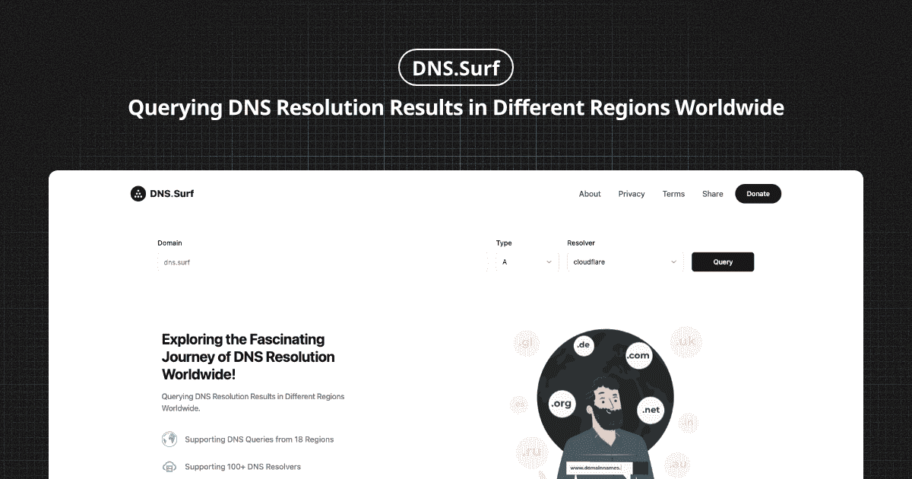

# DNS.Surf

**查询 DNS 在全球各地的解析结果。**



---

[English](./README.md) | 简体中文

## 演示

**Vercel** <https://vercel.dns.surf>

**Cloudflare** <https://cloudflare.dns.surf>

## 原理

### Vercel

Vercel 的 Edge 函数支持自定义部署区域，再通过 DoH 查询 DNS 记录就可以获取到 DNS 在全球各地的解析结果。理论上可以支持 18 个国家或区域。

### Clouflare

Clouflare 的 Worker 部署在全球，通过访问固定区域的 Worker 使用 DoH 查询 DNS 记录就可以获取到 DNS 在全球各地的解析结果。 理论上可以支持 120+ 国家和 330+ 城市。

## 部署

可以支持部署到 Vercel 或者 Cloudflare，互不影响。

### 部署到 Vercel

1. [Fork](https://github.com/ccbikai/DNS.Surf/fork) 项目到你 GitHub
2. 在 Vercel 上创建一个新的项目
3. 选择 DNS.Surf 项目和 `Next.js` 框架
4. 保存并部署
5. 绑定域名（可选）

### 部署到 Clouflare

1. [Fork](https://github.com/ccbikai/DNS.Surf/fork) 项目到你 GitHub
2. 本地使用 `npm run deploy -- --var "CORS_ORIGIN:dns.surf" "WORKER_HOST:dns.html.zone"` 创建一个 Worker。 注意修改变量值： `$CORS_ORIGIN` 网页的域名，用于跨域校验，`$WORKER_HOST` Worker 的访问域名，用于回源。
3. 在 Clouflare Dashboard 给 Worker 关联 GitHub, 并配置打包脚本 `npm run deploy -- --var "CORS_ORIGIN:dns.surf" "WORKER_HOST:dns.html.zone"`。
4. 配置 DNS 解析
   1. 本地使用 `cp .env.example .env` 复制 ENV 文件后
   2. 修改 `WORKER_HOST` 为 Worker 的访问域名, `CLOUDFLARE_ZONE_ID` 对应域名 ZONE 的 ID, `CLOUDFLARE_API_TOKEN` Clouflare 的 API Token, 需要有`读取用户信息`，`编辑 Worker`, `编辑 DNS`权限
   3. 再使用 `npm run cf-dns` 配置 DNS 解析。
5. 在 Clouflare 上创建一个新的 Pages 项目
6. 选择 DNS.Surf 项目和 `Next.js(static)` 框架
7. 设置环境变量 `NEXT_PUBLIC_CLOUDFLARE_WORKER_HOST` 为 Worker 的 URL 访问地址，保存并部署
8. 绑定域名（可选）

## 开发

### Vercel 版

```sh
pnpm install
pnpm run local
```

### Cloudflare 版

后端:

```sh
cp .dev.vars.example dev.vars
## ↑ 访问远端需要修改 WORKER_HOST 为你 Worker 的访问域名
pnpm install
pnpm run worker
```

前端:

```sh
cp .env.example .env
## ↑ 访问远端需要修改 NEXT_PUBLIC_CLOUDFLARE_WORKER_HOST 为你的 Worker URL 访问地址
pnpm run dev
```

## 赞助

1. [在 𝕏 上关注我](https://404.li/x)
2. [在 GitHub 赞助我](https://github.com/sponsors/ccbikai)
